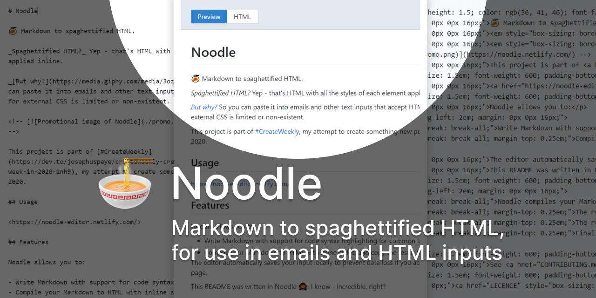

# Noodle

🍝 Markdown to spaghettified HTML. By spaghettified I mean HTML with all styles embedded inline. Useful for pasting in emails and online text inputs that accept HTML.

<!--  -->

This project is part of [#CreateWeekly](https://dev.to/josephuspaye/createweekly-create-something-new-publicly-every-week-in-2020-1nh9), my attempt to create something new publicly every week in 2020.

## Features

Noodle allows you to:

- Write Markdown with support for code syntax highlighting
- Compile your Markdown to HTML with inline styles, and the result to clipboard

## Contributing

See [contribution guide](CONTRIBUTING.md).

## Licence

[MIT](LICENCE)
