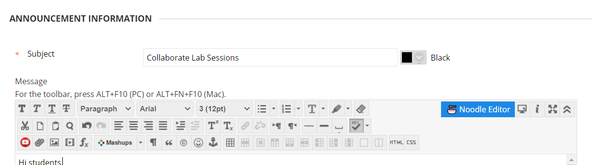
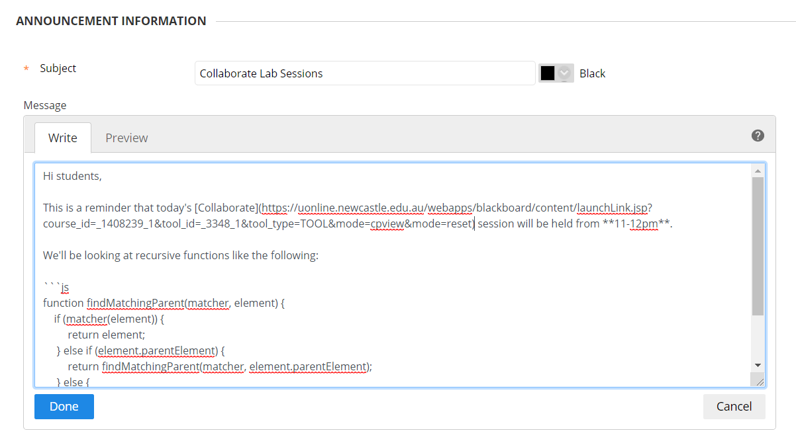
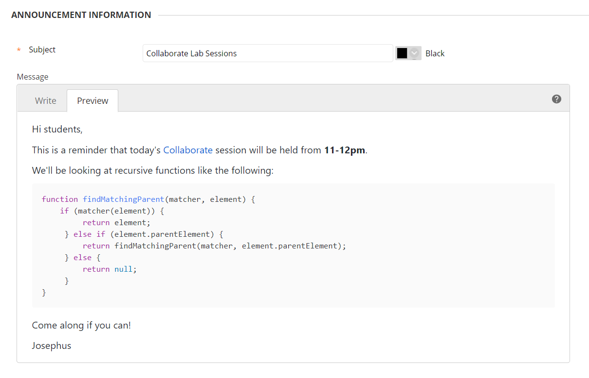

# Noodle the extension

Noodle the extension uses a browser extension to integrate the Noodle editor directly into a webpage, replacing a rich-text editor with the Markdown editor.

For now, it's integrated with [Blackboard Learn](https://uonline.newcastle.edu.au/) version 3800.9.0, the one used at the [University of Newcastle](https://newcastle.edu.au).

- See the [README](https://github.com/JosephusPaye/noodle) for an introduction to Noodle and how it works.
- See <https://noodle-editor.netlify.com> for an online demo.

## Installation

The extension will be published to the Chrome Webstore soon. For now, it can be used in **Developer mode**:

- Download a zip of the latest version from [Releases](https://github.com/josephuspaye/noodle/releases)
- Extract the zip into a known location
- Go to the **Extensions** page in Chrome and enable **Developer mode**
- Click **Load unpacked** and select the extracted zip folder
- Chrome will install the extension, and will show a message each time the browser is restarted that you have **Developer mode** extension. Simply ignore.

## Usage

- Go to a page on Blackboard with a rich-text editor.
- Click the Noodle extension icon in the Chrome extension toolbar, and click **Enable for this domain**.
- The extension will ask to reload the page to load the editor - confirm the prompt.
- A new **🍜 Noodle Editor** button will be added to the Blackboard editor toolbar. Click that to activate the editor.
  

- Edit and preview your content in Markdown and click **Done** when done, or **Discard** to discard any changes.
  
  

- For a quick reference, click the help icon at the top right of the toolbar for a Markdown cheatsheet.

## What's next

- Auto commit (to Blackboard editor) and auto save (to local storage, scoped to current page URL) on changes
- Preserve codeblock language when round-tripping from Markdown to HTML to Markdown
- Support syntax highlighting more languages, add KaTeX for maths
- Add a basic toolbar to help with writing Markdown
- Watch the Blackboard submit button and prompt for a commit if there are any uncommitted editors
- Refactor and get rid of development logs when building for production
- Publish to the webstore for Chrome and Firefox
- Add settings with the following options:
  - don't override font family and font size in the Noodle generated HTML
  - automatically switch to the Noodle editor on page load
- Support other sites
